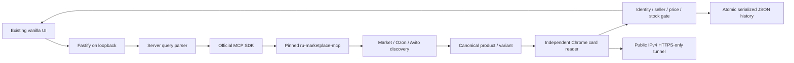

# Architecture

One active search; at most three candidates per source, three sources sequentially. MCP requests have 65-second deadlines and upstream per-source 45-second ceilings. Browser navigation has 30-second deadlines. Source failure is retained separately from offers. MCP SDK implements initialization, stdio or optional loopback Streamable HTTP, reconnect after child exit and bounded calls.

Chrome is created with a dedicated profile, loopback CDP, no sync/accounts, no proxy bypass, and a mandatory local HTTPS CONNECT proxy. The proxy resolves and validates a public IPv4 then connects directly to that address; rejects private/local and plaintext targets. This protects redirect hops, service workers and pages opened by the MCP as well as Scout pages. The additional page route limits navigations to the named marketplace. This is a local single-user design, not a multi-tenant network service or an OS sandbox for the Python process.

Card reader accepts one Product matching the visible H1, one non-aggregate offer and unique marketplace price/seller/availability widgets. Requested specs are never copied into evidence. Title/property contradictions and ambiguous capacities block confirmation. Yandex path ID and sellable variant are separate. No alias between Xiaomi Book and RedmiBook is silently assumed.

History retains original observations, serialized writes and atomic replacement. Corrupt files cause an error and are preserved. Current display recalculates TTL without changing stored observations. Single-process writer only; multi-instance/database scaling needs a separate plan.

## Product images and price filtering (2026-10-01)

Offer thumbnails come from the same marketplace candidate (Yandex native yandex_search on the pinned runtime, strict product+variant join; browser card/anchor images for other sources). Missing source images remain placeholders. Image fields are optional and do not contribute to verification. Native enrichment uses the SDK with a15-second total abort signal and awaited transport shutdown; failure leaves discovery intact.

The browser filters already-loaded offers inclusively by min/max. Current-price mode requires nonexpired VERIFIED and ordinary price. Discovery mode is explicitly unconfirmed. Without bounds all offers show; active bounds exclude unknown prices unless the checkbox is selected. History is not filtered, and its current verification/price display is refreshed at TTL transitions. No data migration; revert this feature commit to roll back.
