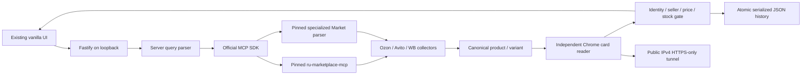

# Architecture

One active search; at most three candidates per source, four sources sequentially. MCP requests have bounded deadlines (Market35s tool/40s total; existing ru65s total); WB geo12s. Browser navigation has30s deadlines. Source failure is retained separately from offers. MCP SDK implements initialization, stdio or optional loopback Streamable HTTP, reconnect after child exit and bounded calls.

Chrome is created with a dedicated profile, loopback CDP, no sync/accounts, no proxy bypass, and a mandatory local HTTPS CONNECT proxy. The proxy resolves and validates a public IPv4 then connects directly to that address; rejects private/local and plaintext targets. This protects redirect hops, service workers and pages opened by the MCP as well as Scout pages. The additional page route limits navigations to the named marketplace. This is a local single-user design, not a multi-tenant network service or an OS sandbox for the Python process.

Card reader accepts one Product matching the visible H1, one non-aggregate offer and unique marketplace price/seller/availability widgets. Requested specs are never copied into evidence. Title/property contradictions and ambiguous capacities block confirmation. Yandex path ID and sellable variant are separate. No alias between Xiaomi Book and RedmiBook is silently assumed.

History retains original observations, serialized writes and atomic replacement. Corrupt files cause an error and are preserved. Current display recalculates TTL without changing stored observations. Single-process writer only; multi-instance/database scaling needs a separate plan.

## Product images and price filtering (2026-10-01)

Offer thumbnails come from the same marketplace candidate (Yandex native yandex_search on the pinned runtime, strict product+variant join; browser card/anchor images for other sources). Missing source images remain placeholders. Image fields are optional and do not contribute to verification. Native enrichment uses the SDK with a15-second total abort signal and awaited transport shutdown; failure leaves discovery intact.

The browser filters already-loaded offers inclusively by min/max. Current-price mode requires nonexpired VERIFIED and ordinary price. Discovery mode is explicitly unconfirmed. Without bounds all offers show; active bounds exclude unknown prices unless the checkbox is selected. History is not filtered, and its current verification/price display is refreshed at TTL transitions. No data migration; revert this feature commit to roll back.

## Native card layer

Discovery → source-native card (and Avito seller where identified) → independent browser reopen → conflict/verification gate. Native observations are additive optional history fields and never substitute for browser evidence. Existing image client also calls yandex_card; Avito has its own stdio client. Ozon has a separate MCP2 Python environment and per-call process/context, with45s tool/50s total deadline plus bounded transport shutdown. Cleanup disposes only newly created CDP contexts while source work is serial; cleanup failure shuts down the owned browser. No browser/account state is imported into specialized contexts. Runtime tool metadata is returned per source; upstream logs remain local. Prices requiring subscriptions/cards are labelled separately and excluded from ordinary-price evidence.

ru discovery stays first for Ozon. A blocked source stops discovery and further card requests. Specialized Ozon search runs only after empty/unavailable nonblocked ru discovery; no subsequent browser fallback for a failed specialized search. Native card errors are recorded; native blocking prevents browser retry. Seller/price/spec/region disagreements prevent VERIFIED. No history migration or new database is required.

Market now uses specialized search_products/get_product upfront through guarded HTTPS, superseding the earlier ru yandex_card path described above. ru yandex_search supplies optional exact-variant images only. Requested city is captured at the API boundary and retained in history. Actual discovery/card city remains independent; only card evidence corroborates the requested city. UI clears results and invalidates pending responses on every city change, including A→B→A. Legacy regionless observations are unverified. WB geo must corroborate coordinates/city/dest before wb_search IDs are reread using regional wb_card calls; search prices are discarded. See CONNECTORS.md for schemas and pins.
