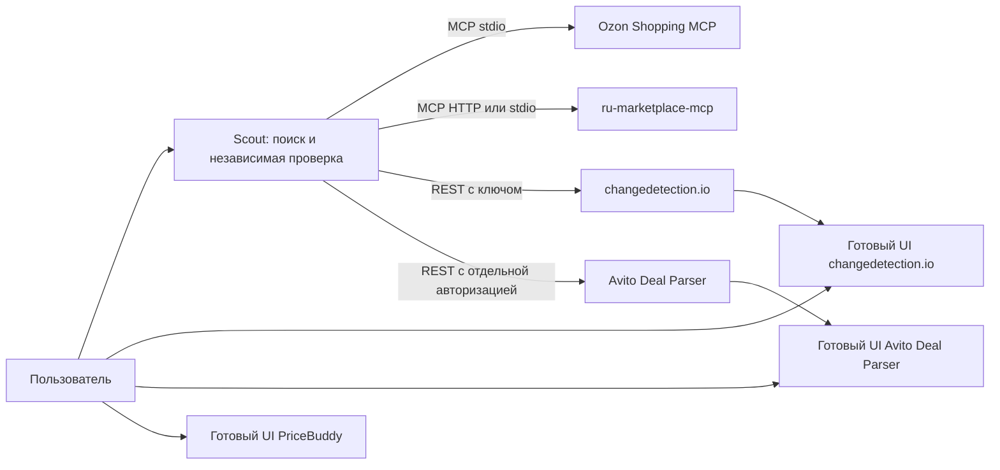

# Повторный Candidate comparison: готовые приложения рядом со Scout

Дата: 1 октября 2026. Статус: **план исследован и прошёл независимую проверку; внедрение ещё не выполнено**.

## Решение

Предыдущая оценка была слишком узкой: сложность переноса PHP/Python/React внутрь Scout использовалась как причина отказаться от целого готового продукта. Это не доказывает непригодность программы, запущенной отдельно. Решение «не переносить исходники» следует отличать от решения «не использовать продукт».

Выбираем композицию самостоятельных приложений: их собственные интерфейсы, хранилища, парсеры и планировщики остаются у них. Scout получает результаты через документированный MCP/REST, а где API недостаточен — открывает готовый интерфейс. Новый универсальный парсер и новая система мониторинга с нуля не нужны.

**Первый внедряемый кандидат — changedetection.io.** Затем Avito Deal Parser и альтернативный Ozon Shopping MCP. PriceBuddy возвращается как отдельный приватный UI-пилот с проверкой условий использования. Это список конкретных этапов, а не ещё один список отказов.

## Контекст и полномочия

- Project ID: marketplace-scout; единственный корень: `D:\Projects\marketplace-scout`; режим continuation, HEAD `7732336`, ветка `feat/marketplace-scout-mvp`, PR #1.
- Последнее поручение владельца: заново оценить готовые решения и подготовить план внедрения или использования без встраивания исходников. В этой итерации разрешены исследование и планирование; новые сервисы, провайдеры и продуктовые экраны не включались.
- Утверждённый продукт: поиск/сбор/анализ предложений Market/Ozon/Avito/WB, Воронеж по умолчанию, без вымышленных цен. Tabler остаётся действующей дизайн-системой Scout; внешний продукт сохраняет собственный UI.
- Неизменяемые границы: личные аккаунты, покупки, автоматическое решение CAPTCHA, ротация IP, платные сервисы и публикация не входят в план. Остановка после ограничения источника сохраняется между экземплярами, а не только внутри одного процесса.
- VERIFIED означает независимое подтверждение карточки, товара, продавца, условий цены и региона. Значение «цена» из сторонней программы само по себе не выполняет этот контракт.
- Предыдущий рабочий процесс на8787 не перезапущен после изменения7732336 из-за автоматического запрета остановки дерева процессов. Это отдельное эксплуатационное ограничение, не основание отвергать внешние программы. В этом исследовании повторной остановки не было.
- Реестр/AI_CONTEXT содержит исторические указания на старый дизайн и CI billing; текущий PRODUCT_SCOPE и уже проверенные CI имеют соответствующие явно зафиксированные исправления. Посторонние незакоммиченные knowledge-файлы не изменены.

## Что проверено заново

Восемь репозиториев проверены через GitHub API; у пяти прочитаны конкретные исходники, лицензии и интерфейсы подключения. [Снимок SHA, файлов и контрольных сумм](../evidence/2026-10-01-external-solutions-research.json). Дополнительно прочитан уже установленный `ru-marketplace-mcp/docs/DEPLOYMENT.md` и существующий клиент Scout.

Проверено на компьютере: Node24.19.0 доступен; Docker CLI установлен, Linux engine сейчас не отвечает. Это не блокирует Windows/Python и Node-пилоты. Docker Desktop не запускался, образы/зависимости новых приложений не устанавливались. Уязвимости этих новых окружений ещё не сканировались, живые цены ими не получены.

## Пересмотренная матрица кандидатов

| Решение | Что используем целиком | Способ подключения | Новое решение |
|---|---|---|---|
| [changedetection.io](https://github.com/dgtlmoon/changedetection.io) | Готовый UI, watches, снимки, diff, история, извлечение цены/наличия, собственное хранилище | Отдельный Windows Python-процесс; REST `/api/v1`, `x-api-key`; собственный браузерный backend при необходимости | **Первый пилот.** Прежнее «только ориентир» отменено. Наблюдение известных URL — полезная часть продукта, даже если оно не заменяет discovery |
| [Grovvik/avito-deal-parser](https://github.com/Grovvik/avito-deal-parser) | React dashboard, задачи поиска, изображения объявлений, история, готовые Avito scrapers, Node backend | Отдельное приложение; его UI; REST `/api/status`, `/api/deals`, `/api/config`, `/api/action/run-check` | **Внедрять вторым этапом**, с небольшим внешним patch-набором безопасности/lifecycle. React не переносится в Scout |
| [neosheps/ozon-shopping-mcp](https://github.com/neosheps/ozon-shopping-mcp) | Полный Ozon-клиент, парсер, собственная анонимная сессия, очередь, инструменты поиска/карточки/отзывов | Отдельный stdio-процесс, `node dist/cli.js serve`; отдельный `OZON_MCP_STATE_DIR` | **Альтернативный runtime для сравнительного пилота**, не отложенный навсегда «резерв». Его не подменяют текущим SZhukovWork-пакетом |
| [PriceBuddy](https://github.com/jez500/pricebuddy) | Полный готовый продукт с интерфейсом, БД, историей и собственным scheduler/scraper | Отдельный Docker Compose и собственный UI; передача выбранных URL через UI на первом этапе | **Приватный UI-пилот после проверки применимости лицензии.** Несовпадение стека больше не причина отказа; API истории пока не обещаем |
| [ru-marketplace-mcp](https://github.com/Vladimir-Human/ru-marketplace-mcp) | Исходные самостоятельные entry points `marketplace-mcp`, `compare-mcp`, `wb-mcp`, `avito-mcp`, `yandex-mcp` | Реально поддерживает stdio и Streamable HTTP; выделенный экземпляр/профиль | **Сохранить и испытать как самостоятельный сервис.** Не считать существующие обёртки доказательством полноценного использования всех исходных возможностей |
| [SZhukovWork/yandex-market-mcp](https://github.com/SZhukovWork/yandex-market-mcp), [ozon-mcp](https://github.com/SZhukovWork/ozon-mcp) | Уже установленные инструменты, схемы и парсеры | Отдельные процессы; сравнение исходного поведения с текущими адаптерами в контролируемом стенде | **Базовые участники сравнения.** Зафиксировать, какие изменения транспорта/сессий внесены Scout и как они влияют на результат |
| [FaHoLo/Avito_parser](https://github.com/FaHoLo/Avito_parser) | Готовый Python/Redis/Telegram workflow поиска | Отдельный процесс и Redis; существующего REST нет в прочитанном entry point | **Второй Avito-кандидат для сравнительного стенда**, если Grovvik не проходит проверку. Telegram — отдельное действие, не включать автоматически; это не Excel dashboard |
| [Duff89/parser_avito](https://github.com/Duff89/parser_avito), [LightWolf11/AvitoParser](https://github.com/LightWolf11/AvitoParser), [eduard256/ozon-mcp-server](https://github.com/eduard256/ozon-mcp-server) | Возможные отдельные приложения/экспортёры | Сначала установить условия использования; затем собственный UI/экспорт/процесс | **Отложить до подтверждения прав**, а не отбрасывать по стеку. Отдельный процесс не отменяет лицензионные ограничения |
| CoreUI / Refine | Альтернативные готовые UI/framework | Возможна отдельная reference app | Не включать вторую дизайн-систему в уже выбранный Tabler. Эти проекты не являются коннекторами; повторное использование внешних приложений не требует их миграции |

Seller API-проекты из предыдущего отчёта остаются отдельным направлением для владельцев магазинов: для них нужны ключи кабинета, а не только новая схема запуска. Новый поиск также нашёл `DeviceIngineering/wb-mcp-server` и `wildberries-tech/wildkit`; это seller/public API tooling, не доказанный источник анонимной розничной цены. Их можно использовать при будущем явно согласованном сценарии кабинета продавца.

## Версии, права и зрелость

| Кандидат | Проверенная ревизия | Права / сопровождение / стоимость |
|---|---|---|
| changedetection.io | `0e0566721b1c483dcf7ae548210ee10532d9b181` | Apache-2.0; последний обнаруженный релиз0.60.8 от28.09.2026. Нужны отдельные Python-зависимости, datastore и браузер. Релиз и проверенный commit необходимо сопоставить перед установкой |
| Grovvik | `cd5ca6ff365bbd480e918dd589dcf0b59afed819` | MIT; package2.2.0; push30.08.2026. Небольшой проект, зависимости с диапазонами; аудит lock/build обязателен. Node+Playwright+готовый frontend; тестовый script в корневом package.json отсутствует |
| neosheps | `2ec1c7071ca44c8b8c44497c4e801158f26aeaa5` | MIT; package0.1.1; push25.09.2026. Alpha, внутренние Ozon endpoints; Node>=24 совместим с текущим компьютером. MCP SDK2 живёт в отдельном процессе и не требует замены SDK Scout |
| PriceBuddy | `602eed0eb38407cb6e39da6645c36e93c2192ffa` | LICENSE: GPL-3.0 WITH MODIFICATIONS, ограничение коммерческого применения. Раздельный запуск это ограничение не снимает. Последний обнаруженный релизv1.0.54 от09.08 отличается от проверенного HEAD; нужны сверка лицензии выбранной версии и pin image digest. App+MySQL+scraper тяжелее остальных |
| FaHoLo | `7e48a54bb54135b4fe269bf5c8b8d4656e4eff38` | MIT; push15.05.2026. Python+Redis+TG; больше адаптации при отсутствии аккаунтов/уведомлений, поэтому Grovvik приоритетнее |

Число звёзд и отсутствие issues не доказывают надёжность. Зафиксированы source pins; установленных новых компонентов пока нет. Внешний fork хранит исходную лицензию, отдельный patch-list и не маскируется под неизменённый upstream.

## Схема использования без встраивания исходников

Два режима внедрения:

1. **Без изменений кода Scout:** запустить отдельные приложения, пользоваться их UI и исходными MCP-инструментами в отдельном тестовом клиенте; передавать публичные URL выбранных карточек. Это уже использование готовых решений, а не переписывание их функций.
2. **Тонкое подключение в Scout:** добавить конфигурацию запуска/endpoint, транспортный клиент и преобразование ответа в неподтверждённое наблюдение. Парсеры, графики, scheduler и базы внешнего приложения не переносить. Если API не покрывает функцию, открывать готовый UI вместо создания фиктивного REST-контракта.

Предлагаемое размещение внутри канонического проекта: `.runtime/external/<provider>/<revision>` — исходники/venv; `.data/external/<provider>` — отдельное состояние; `integrations/<provider>` — только проверенные manifest/config/patches. Это будущие пути, ещё не созданные новые продукты. Порты для плана: changedetection8791, Avito8792, PriceBuddy8793, ru MCP8794; сначала проверить занятость. Только127.0.0.1; у neosheps stdio, HTTP-порт не нужен. Браузеры каждого процесса имеют собственные каталоги и lifecycle, не используют профиль/CDP9337 работающего Scout.

**Фактическая граница текущего кода:** `RU_MARKETPLACE_MCP_URL` уже есть, но работает только для общего клиента без explicit executable. Market/WB/Avito специализированные клиенты им не переключаются. Кроме того, текущий Ozon discovery вызывает `browserRuntime.ensure()` до общего MCP — одна переменная не превращает этот маршрут в независимый внешний runtime. Это нужно исправить в этапе подключения, а не обещать plug-and-play сегодня.

## Контракты подключения, подтверждённые исходниками

### changedetection.io

Источник: [OpenAPI проверенного commit](https://github.com/dgtlmoon/changedetection.io/blob/0e0566721b1c483dcf7ae548210ee10532d9b181/docs/api-spec.yaml), [Windows installation](https://github.com/dgtlmoon/changedetection.io/wiki/Microsoft-Windows).

Доступны `POST /api/v1/watch`, `GET /api/v1/watch/{uuid}`, `GET /api/v1/watch/{uuid}/history`, `GET /api/v1/watch/{uuid}/history/{timestamp}`. API использует `x-api-key`. Создаём watch приостановленным (`paused=true`), отключаем внешние уведомления; отдельно проверяем, что создание не вызвало внеплановый fetch. Для однократного запуска проверяем семантику `recheck` в выбранной версии и подтверждаем счётчиком запросов, что это одна проверка, затем снова paused.

`restock_diff` предоставляет готовое отслеживание цены/наличия. History — это снимки, а не обещанный массив нормализованных рублёвых цен; selectors/JSON-LD могут давать условную цену или другой вариант. Возвращаем source/time/raw snapshot/reference URL и отдельно отмечаем неизвестные seller/region/variant. График внешнего приложения можно открыть непосредственно. Переход к автоматическому VERIFIED исключён.

### Avito Deal Parser

Источник: [WebServer.js](https://github.com/Grovvik/avito-deal-parser/blob/cd5ca6ff365bbd480e918dd589dcf0b59afed819/src/web/WebServer.js), [ScraperRegistry.js](https://github.com/Grovvik/avito-deal-parser/blob/cd5ca6ff365bbd480e918dd589dcf0b59afed819/src/scrapers/ScraperRegistry.js).

REST выше существует; `run-check` возвращает запуск, не готовый результат — завершение определять по статусу/истории. REST принимает `x-auth-hash`; это секрет доступа, а не безопасная публичная контрольная сумма. Не отправлять его в URL и браузерный код Scout. `/api/config` содержит чувствительные настройки, `/api/cookies` не нужен импорту предложений.

До live-пилота сделать ограниченные внешние patches: bind loopback; обязательная HTTP и WebSocket авторизация; origin allowlist; broadcasts только авторизованным sockets; запрет выдачи конфигурации/cookies через общий канал. В upstream `io.emit` может разослать конфигурацию неавторизованным сокетам даже при WEB_PASSWORD. Простого задания пароля недостаточно.

Поллинг и Telegram/Discord/MQTT выключены. `scrapersOrder` только меняет порядок, не отключает fallback. Для пилота оставить один extractor и прекращать его работу/очередь на403/429/challenge; не переключать автоматически способы доступа. Использовать собственные анонимные cookies; не импортировать пользовательские. Сохранить исходный dashboard и scrapers, не переписывая их в Scout.

### Ozon Shopping MCP

Источник: [mcp-server.ts](https://github.com/neosheps/ozon-shopping-mcp/blob/2ec1c7071ca44c8b8c44497c4e801158f26aeaa5/src/mcp-server.ts), [config.ts](https://github.com/neosheps/ozon-shopping-mcp/blob/2ec1c7071ca44c8b8c44497c4e801158f26aeaa5/src/config.ts), [browser-session.ts](https://github.com/neosheps/ozon-shopping-mcp/blob/2ec1c7071ca44c8b8c44497c4e801158f26aeaa5/src/browser-session.ts).

Инструменты: `ozon_search`, `ozon_product`, `ozon_reviews`, `ozon_health`, `ozon_setup_session`. Использовать stdio без HTTP-прокси. Переменные: `OZON_MCP_STATE_DIR`, `OZON_MCP_BROWSER_CHANNEL`, `OZON_MCP_EXECUTABLE_PATH`, интервалы/таймауты. Не брать плавающий `npx ...@latest`; собирать проверенный commit/lock и запускать локальный dist/cli.js.

Первое испытание — исходные offline tests, initialize/tools-list, health без восстановления сессии. Затем ограниченный анонимный setup: upstream повторяет probe каждые1.5с до120с, поэтому live запуск нуждается в patch «одна попытка, stop на блокировке» и явном отчёте. Автоматический setup из поискового запроса не включать. Исходные флаги браузера/хранение сессии просмотреть отдельно; не обещать успех штатного запуска и не решать CAPTCHA автоматически. Сохраняем готовый клиент и парсер, меняем только управление жизненным циклом.

### PriceBuddy

Источник: [routes/api.php](https://github.com/jez500/pricebuddy/blob/602eed0eb38407cb6e39da6645c36e93c2192ffa/routes/api.php), [Compose](https://github.com/jez500/pricebuddy/blob/602eed0eb38407cb6e39da6645c36e93c2192ffa/docker-compose.yml), [лицензия](https://github.com/jez500/pricebuddy/blob/602eed0eb38407cb6e39da6645c36e93c2192ffa/LICENSE.md).

Проверены только `/api/user`, `/api/meta-extraction`, `/api/client-config` с Sanctum abilities. Нет подтверждённого API списка товаров/истории в прочитанном маршрутизаторе. Этап1 — самостоятельный UI, без прямого чтения его MySQL и без обещаний автоматической синхронизации. Если документированный экспорт найдётся и пройдёт контрактный тест, добавить импорт; иначе UI остаётся полноценным способом использования.

Compose включает app+MySQL+scraper, значения паролей по умолчанию и `AFFILIATE_ENABLED=true`. Перед запуском: уникальные локальные credentials, отключённые affiliate/внешние уведомления/платные AI-интеграции, непубличная БД, закреплённые образы, отдельные volumes. Для некоммерческого приватного пилота проверить условия выбранной ревизии; коммерческую дистрибуцию/включение нельзя объявить допустимой из-за раздельных процессов.

## Поэтапный план с готовыми результатами

Оценки — предварительные инженерные трудозатраты, не обещание календарного срока и не гарантия доступа маркетплейсов.

| Этап | Работы и готовый результат | Приёмка | Оценка / откат |
|---|---|---|---|
| 0. Воспроизводимый стенд | Source/lock/hash/license manifest; учёт портов/профилей; отдельные состояния; разрешённые source/tool; перечень отличий текущих адаптеров от upstream | Нет изменений `.data/history.json`, работающего8787 и чужих профилей; можно остановить каждый пилот независимо | 0.5–1 день; убрать регистрацию пилота, состояние оставить |
| 1. changedetection.io | Полный UI на8791 через Windows venv; paused watch на реальный публичный URL; одна проверка; REST чтение истории/снимка | Реальный API roundtrip, auth, snapshot/time/error, pause сохраняется после restart; 403 не становится ценой; виден готовый внешний интерфейс | 1–2 дня; остановить только owned instance, сохранить datastore |
| 2. Avito Deal Parser | Полный backend/frontend, небольшой внешний security/lifecycle patch-list; одна задача поиска Воронежа; изображения/история в готовом UI | HTTP+WS unauth не получают config/deals/logs; один fetch; живое объявление либо конкретный blocked; при успехе GET/deals сохраняет ID/URL/time | 2–3 дня; отключить импорт/процесс, сохранить data; исходный upstream отдельно от patches |
| 3. Ozon Shopping MCP | Отдельный stdio runtime/аноничное состояние; upstream tests и ограниченный setup; search→product через исходные инструменты | tools/list совпадает с сохранённой схемой; exactURL/SKU; prices/conditions/region записаны как есть; expired/block останавливают очередь без setup-loop | 1–2 дня; вернуть routing на прежний provider, состояние не удалять |
| 4. ru/Market/WB baseline | Standalone MCP штатными entry points; документировать транспортные отличия Scout; проверять выбранный регион и точные IDs | Сравнить один и тот же запрос по одинаковым критериям, отдельно от блока источника. Нельзя запускать альтернативный клиент немедленно после403 или сбрасывать cooldown | 1–2 дня; вернуть прежнюю конфигурацию, сохранить журнал сравнений |
| 5. Тонкое подключение | Provider-specific config, server-side REST/MCP adapters; ссылки на внешние UI; внешний observation store отдельно от verified history | Поиск/наблюдение имеет source/version/time; нет повторной записи и конфликта городов; недоступность сервиса не ломает Scout | 1–2 дня; feature flag off, прежние routes/store остаются |
| Дополнительный PriceBuddy-пилот | Лицензионная сверка и Docker availability; полный изолированный UI без истории-REST предположений | Реальный URL добавлен в его UI; видны собственные history/error; default credentials/affiliate отключены; startup/recovery проверены | 1–2 дня после условий; остановить compose, сохранить volumes |

Для всех этапов отдельно фиксируются: INSTALLED, CONTRACT_OK, UI_OK, LIVE_READ_OK, EXACT_PRODUCT_VERIFIED. Проект, успешно показывающий историю, может пройти свой этап приёмки, но это не выдаётся за подтверждённую цену RedmiBook в Воронеже. Если live-доступ ограничен, сохраняется работающий интеграционный результат и конкретный этап отказа; кандидат не вычёркивается только потому, что первая карточка не открылась.

Ресурсный режим первого пилота: один активный worker, один браузер и одна карточка за раз; остальные сервисы могут быть выключены. Измерить idle/peak RAM, число процессов, время запуска/завершения и прирост datastore после десяти сохранений. Автозапуск ОС и постоянное расписание не включать на первом этапе. Кандидат проходит эксплуатационную приёмку, если после остановки не оставляет браузеры/занятые порты, после запуска восстанавливает тот же watch/history и не запускает отложенные сетевые задания самопроизвольно. Численные RAM/disk потребности до измерения неизвестны; их нельзя объявлять малыми только из-за небольшой толщины адаптера.

## Шесть аудитов и сравнение вариантов

- Продукт: нужно получить пользу от готовых приложений, а не только увеличить число инструментов в каталоге. Полноценные внешние интерфейсы/история/мониторинг прямо закрывают прежний пробел.
- Архитектура: процессы раздельны, API/MCP вместо импорта внутренних классов; перезапуск/обновление/БД независимы. Новые наблюдения не подменяют verification/history contract.
- Структура: manifests/patches в integrations, исполняемый upstream в runtime, данные отдельно; провайдеры именуются уникально, разные ozon-mcp не смешиваются.
- Техника: Node24 подходит; Python Windows путь документирован; Docker engine недоступен, поэтому первый этап его не требует. Нужны реальные dependency/image scans после установки, лимиты памяти/процессов измеряются на пилоте.
- Дизайн: готовые внешние UI используются непосредственно; проверяются клавиатура, контраст, узкий экран, error/loading и темы, а не предполагаются доступными по README. Scout сохраняет Tabler; скрытого редизайна в плане нет.
- Качество: контрактные/offline/live результаты разделены, auth/SSRF/redirects/timeout/cleanup/backup тестируются. Сервисам нужны независимые egress-границы: запуск на loopback защищает входящий доступ, но не запрещает исходящие запросы к локальной сети. Перед live не принимать произвольные URL/скрипты от внешнего клиента; ограничить target domains и проверить private-IP redirects. Секреты/сессии не идут в API Scout, Git или отчёты.

Варианты: оставить нынешние обёртки — минимальная работа, но не отвечает требованию; переносить все исходники в монолит — высокая связанность; **использовать самостоятельные готовые приложения с узкими адаптерами — выбранный план**; новый собственный стек парсеров/мониторинга — не нужен. Различие стека теперь учитывается только как эксплуатационная стоимость. У сторонних приложений остаётся стоимость обновлений, диска, БД и браузеров; её измеряют, а не скрывают.

## Проверка плана и следующий шаг

Независимый критик изучил исходники и дал **GO для плана и исследовательских материалов**; итоговая проверка готового документа также GO без блокирующих замечаний. Независимо сверены все 27 SHA-256 прочитанных файлов манифеста. Локальные ссылки и структура JSON проверены. Условия включены в этапы: Grovvik HTTP/WS leakage исправить до live; neosheps setup-loop ограничить; PriceBuddy использовать через существующий UI, не выдуманный API; snapshot не равен VERIFIED. Это не утверждение, что установка выполнена или runtime прошёл живую приёмку.

Следующий конкретный результат — этап1: отдельный changedetection.io со своим интерфейсом и доказанным API кругом watch→check→history/snapshot, без миграции Scout. Переход к исполнению выбранного плана согласуется с владельцем; текущее поручение было на повторный анализ и подготовку плана. Никакие уведомления/покупки/аккаунты/фоновые автоматизации этим документом не включены.

Операционные свидетельства: [upstream issue3845](https://github.com/dgtlmoon/changedetection.io/issues/3845) показывает, почему processor/import нужно сверять с версией; [discussion4133](https://github.com/dgtlmoon/changedetection.io/discussions/4133) — пользовательский отчёт о потерях watch rows, не доказанный диагноз. Поэтому версия закрепляется, persistence/backup проверяются. Исходные UI-примеры находятся в README самих проектов; дополнительный чужой визуальный стиль здесь не выбирается.
